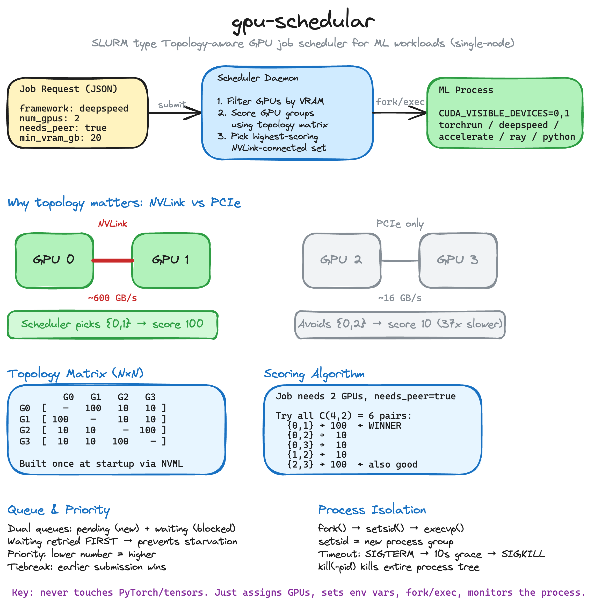

# gpu-orchestrator

Small single-node GPU scheduler written in C++.

It runs a daemon, accepts JSON jobs over a Unix socket, and assigns free GPUs.
For local development, the project includes a mock NVML mode, so `make` works
even on machines without NVIDIA drivers.

## Architecture



## Demo

[Watch the video on YouTube](https://youtu.be/-Xjaw0xE1Zo)

## Quick start

```bash
make
make test
make start
make status
make submit-fast
```

`make` builds the default local setup:

- `gpu-scheduler-mock`
- `gpu-submit`
- `gpu-status`

Use `make real` on a Linux machine with NVIDIA drivers, `nvml.h`, and
`libnvidia-ml` installed.

To run the real scheduler:

```bash
make real-start
./gpu-status
```

## Useful targets

- `make` - build the mock scheduler and CLI tools
- `make real` - build the NVML-backed scheduler
- `make test` - build and run unit tests
- `make run` - run the mock scheduler in the foreground
- `make start` - start the mock scheduler in the background
- `make real-start` - start the real scheduler
- `make status` - show scheduler status
- `make submit-fast` - submit the sample fast job
- `make clean` - remove build output

Run `make help` to see the rest of the targets.

## Project layout

- `src/` - daemon, scheduler, and runtime code
- `include/` - headers
- `tools/` - CLI clients
- `scripts/` - sample jobs and helper scripts
- `test/` - unit tests
